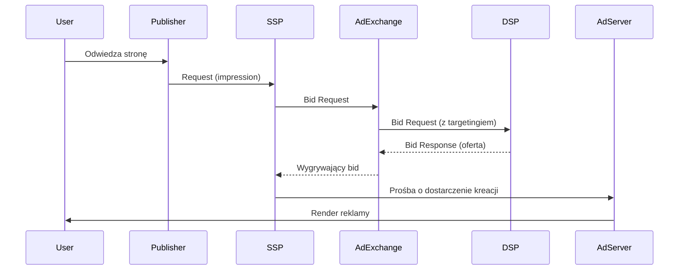

# 2. Architektura RTB (Real-Time Bidding)

> **Cel modułu:**
> Po ukończeniu modułu uczestnik rozumie, jak działa proces aukcji RTB, zna role poszczególnych komponentów (DSP, SSP, Ad Exchange, Ad Server) oraz potrafi odczytać podstawowy diagram przepływu.

---

## 1. Kluczowe pojęcia
- **Ad Exchange** – rynek, na którym SSP i DSP spotykają się, aby przeprowadzać aukcje reklamowa.
- **Ad Server** – system dostarczający kreacje reklamowe i mierzący ich wyświetlenia/impressiony.
- **Auction Dynamics** – proces licytacji, który obejmuje:  
  1. Request (SSP)  
  2. Bid Request (Ad Exchange)  
  3. Bid Response (DSP)  
  4. Ad Selection & Delivery (SSP/Ad Server)

---

## 2. Diagram przepływu RTB

---

## 3. Step-by-Step: RTB Workflow
1. **Użytkownik wchodzi na stronę**  
   Wywoływana jest prośba o reklamę.
2. **SSP generuje Bid Request**  
   Zawiera informacje o stronie, userze, targetowaniu.
3. **Ad Exchange przekazuje Bid Request**  
   Do zarejestrowanych DSP.
4. **DSP przetwarza dane i wysyła Bid Response**  
   Ustalana jest maksymalna cena (bid) na podstawie algorytmu.
5. **Ad Exchange wyłania zwycięzcę aukcji**  
   Najwyższa oferta wygrywa.
6. **SSP prosi Ad Server o dostarczenie kreacji**  
   Ad Server dostarcza zabidowaną reklamę.
7. **Reklama jest wyświetlana użytkownikowi**  
   Mierzone są odsłony, kliknięcia, viewability.

---

## 4. Practical Checklist
::: checklist
- [ ] Rozumiem, które komponenty biorą udział w RTB
- [ ] Potrafię opisać kolejność kroków w aukcji RTB
- [ ] Znam różnicę między SSP a Ad Exchange
- [ ] Umiejętnie odczytuję diagram mermaid
:::

---

## 5. Further Reading / Linki
- [OpenRTB Specification](https://iabtechlab.com/standards/openrtb)
- [Glossary: Ad Exchange](../glossary/ad-exchange.md)
- [Moduł 3: Kluczowe pojęcia DSP & SSP](3-key-concepts.md)

---

<button class="flashcard">Pokaż definicję Ad Exchange</button>

Ad Exchange to elektroniczny rynek, na którym SSP i DSP przeprowadzają aukcje reklamowe w czasie rzeczywistym, wymieniając bid requests i bid responses.

