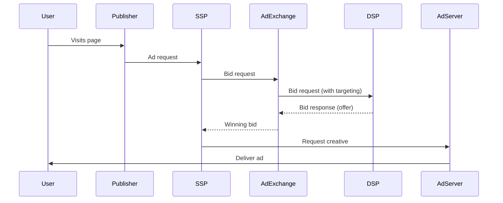

# 2. RTB Architecture (Real-Time Bidding)

> **Module goal:**
> After completing this module, you will understand how the RTB auction process works, know the roles of each component (DSP, SSP, Ad Exchange, Ad Server), and be able to read a basic flow diagram.

---

## 1. Key Concepts
- **Ad Exchange** – the marketplace where SSPs and DSPs meet to conduct ad auctions.
- **Ad Server** – a system that serves creatives and tracks impressions.
- **Auction Dynamics** – the bidding process, including:  
  1. Request (SSP)  
  2. Bid Request (Ad Exchange)  
  3. Bid Response (DSP)  
  4. Ad Selection & Delivery (SSP/Ad Server)

---

## 2. RTB Flow Diagram

---

## 3. Step-by-Step: RTB Workflow
1. **User visits page**  
   An ad request is triggered.
2. **SSP generates a Bid Request**  
   Includes page, user, and targeting data.
3. **Ad Exchange forwards the Bid Request**  
   To registered DSPs.
4. **DSP processes data and sends a Bid Response**  
   Determines bid price via algorithm.
5. **Ad Exchange selects the winner**  
   Highest bid wins.
6. **SSP requests creative from Ad Server**  
   Ad Server serves the winning ad.
7. **Ad is displayed to user**  
   Impressions, clicks, viewability are tracked.

---

## 4. Practical Checklist
::: checklist
- [ ] I know which components participate in RTB
- [ ] I can describe the RTB auction steps
- [ ] I understand the difference between SSP and Ad Exchange
- [ ] I can read a Mermaid flow diagram
:::

---

## 5. Further Reading / Links
- [OpenRTB Specification](https://iabtechlab.com/standards/openrtb)
- [Glossary: Ad Exchange](../glossary/ad-exchange.md)
- [Module 3: Key Concepts DSP & SSP](3-key-concepts.md)

---

<button class="flashcard">Show Ad Exchange definition</button>

An Ad Exchange is an electronic marketplace where SSPs and DSPs conduct real-time auctions by exchanging bid requests and bid responses.

